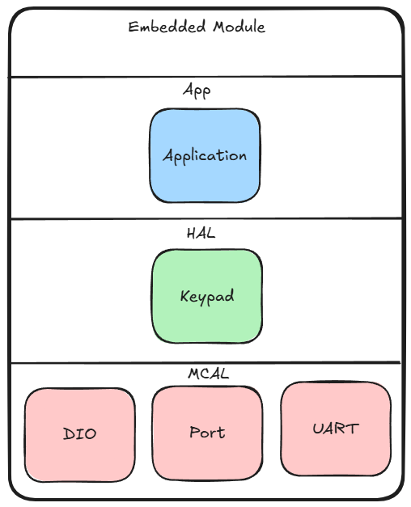
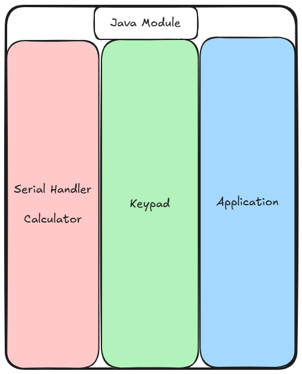

# Calculator

This project is a cross-platform calculator that integrates hardware input using an AVR-based keypad. It was developed as the final project for the ITI Intake 45 Intro to Java Course.

## Overview

The **Calculator** application runs on a PC using a JavaFX interface and supports both standard keyboard input and input from an **external AVR-based keypad** connected via USB-to-Serial communication. The project demonstrates embedded systems integration with a desktop GUI using serial communication.

## Team Members

- **Abdelrhman Abdelaziz Fayed**
- **Mariam HossamEldin Saleh**
- **Mousa Mahmoud Salah**

## Features

- Perform basic arithmetic operations (addition, subtraction, multiplication, division).
- Input from both:
  - JavaFX UI (via mouse/keyboard)
  - External AVR-based hardware keypad (via serial port)
- Real-time interaction between PC and embedded device

## Technologies Used

- **JavaFX** – for the desktop GUI
- **Java Serial Communication** – for interfacing with the AVR device
- **AVR Microcontroller** – for the keypad interface and serial transmission
- **USB-to-Serial Converter** – for connecting the AVR device to the PC

## Project Structure

## How It Works

1. The AVR microcontroller reads key presses from a connected keypad.
2. When a key is pressed, the AVR sends a corresponding character over the serial port.
3. The JavaFX application listens to the serial port and displays the character on the calculator screen, processing input just as if it came from the GUI.
